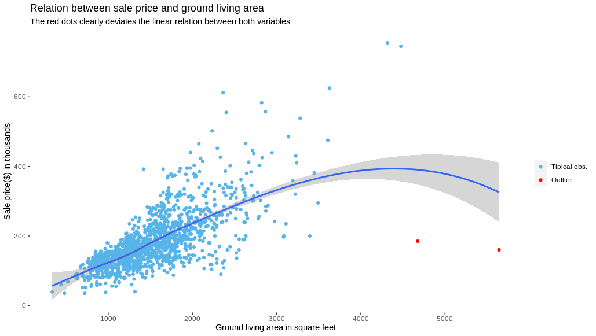

## House Prices: Advanced Regression Techniques

Kaggle competirion to predict the price of the houses. 
All the scripts will be managed fir the fille colled **octopus**. 

### 1. Import data

### 2. Data quality

#### Outliers

There are two houses with a high ground living area and a relative low price, as you can see in the following graph:

### 3. Pre-process 

### 4. Modalization

### 5. Error analysis or Deployment 

## Conclusion 
